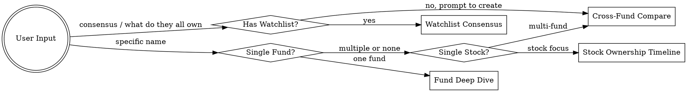

# 13F Institutional Holdings Analysis

## Overview

Analyze SEC 13F filings to track what major institutional investors are buying, selling, and holding. Core capability: fetch raw data from SEC EDGAR, parse holdings, compare across quarters, and produce readable reports for retail investors and independent researchers.

**13F = quarterly snapshot of long positions for US institutions managing >$100M. Filed within 45 days of quarter-end.**

## When to Use

- User asks about institutional holdings or 13F filings
- User names a fund manager and wants portfolio analysis
- User wants to compare holdings across quarters or across managers
- User asks "what is [manager] buying/selling"
- User wants sector/industry allocation analysis
- User asks about a specific stock's institutional ownership history

## Limitations to Always Disclose

1. **45-day lag** — Q2 data appears by ~Aug 15, reflects June 30 snapshot
2. **Long-only** — no shorts, options, futures, or derivatives visible
3. **Confidential treatment** — active positions may be hidden temporarily
4. **Snapshot only** — high-frequency/quant funds may have turned over positions within the quarter

## Language Detection

Detect the user's language from their input. The report should adapt to match:

**English user (default):**
- All UI: tab labels, section headers, badges, insight text — English only
- Stock names: English only (e.g., "ALPHABET INC", "BANK OF AMERICA")
- Footer disclaimer: English only
- No Chinese anywhere in the report

**Chinese user:**
- All UI: tab labels, section headers, badges, insight text — Chinese (with English subtitle where helpful)
- Stock names: localized names plus English ticker/company name where helpful
- Footer disclaimer: bilingual
- Manager profile section: Chinese

Use bilingual or localized labels only when they clearly improve usability for that user.

## Onboarding

When the user's input is vague (e.g., just "13F", "holdings", "show me some funds"), **show the Quick Menu from filers-database.md** — a categorized list of popular managers with numbered options.

If user has a watchlist file (`13f_watchlist.md` in the working directory), mention it: "You have X managers in your watchlist. Want to see the latest updates?"

## Input Recognition

User may provide:
- Fund manager name (e.g., "Buffett", "Druckenmiller")
- Fund/entity name (e.g., "Berkshire Hathaway", "Bridgewater")
- CIK number directly
- A stock ticker for reverse lookup (Mode 3: "Who owns TSLA")
- A number from the Quick Menu
- "my watchlist" — load from watchlist file
- "compare X and Y" — Mode 2
- **A description/requirement** — see Discovery Mode below

**First step:** Map input to CIK number. Check filers-database.md for known filers. If not found, try Discovery Mode or search SEC EDGAR.

## Discovery Mode

When the user doesn't know a specific name but describes what they want, enter Discovery Mode:

**Trigger phrases:**
- "Recommend some managers to follow"
- "Who runs a tech-heavy portfolio"
- "Who invests like Buffett"
- "Which managers are buying China-related stocks"
- "I want concentrated, long-term value investors"
- "Show me smaller managers with strong conviction"
- Any vague description of a style, sector, or preference

**Flow:**

1. **Parse the requirement** — extract keywords: style (concentrated/diversified, value/growth), sector preference (technology/financials/consumer), scale (large/small), geography (China-related/US), etc.

2. **Search in filers-database.md first** — filter the 20 pre-mapped managers by matching criteria. Present as options:

```text
Based on your request for "concentrated value investors", here are strong fits:

  A. Duan Yongping (Himalaya) -- ultra-concentrated, very low turnover
  B. Bill Ackman (Pershing) -- concentrated activist value
  C. Seth Klarman (Baupost) -- selective deep value, highly private
  D. Mohnish Pabrai -- extremely concentrated Buffett-style investor

Which one would you like to see? You can pick multiple (for example "A and D"), or say "add them all to my watchlist".
```

3. **If no match in database** — search SEC EDGAR using EFTS full-text search:
```
GET https://efts.sec.gov/LATEST/search-index?q={keywords}&forms=13F-HR
```
Present discovered filers as options with basic info (entity name, CIK, recent filing date).

4. **User selects** → proceed to Mode 1 (single fund) or add to watchlist

**Key principles:**
- Always give **numbered/lettered options**, don't just dump a list
- Include a one-line hook for each option explaining WHY it matches the user's requirement
- Offer to "add them all to my watchlist" as a quick action
- If the user's requirement is about a specific stock ("who is buying NVDA"), redirect to Mode 3 instead

## Watchlist

Users can maintain a personal watchlist at `13f_watchlist.md` in their working directory.

**Format:**
```markdown
# My 13F Watchlist

- Duan Yongping / Himalaya Capital (CIK 0001709323)
- Warren Buffett / Berkshire Hathaway (CIK 0001067983)
- Bill Ackman / Pershing Square (CIK 0001336528)
```

**Operations:**
- "add Druckenmiller to my watchlist" → append to file, confirm
- "remove ARK from my watchlist" → remove from file, confirm
- "my watchlist" → read file, list all
- "watchlist update" → for each manager, fetch latest quarter, generate a one-line summary of changes. Output as a summary table:

```text
Watchlist Updates (Q4 2025)

| Manager | Latest action | Portfolio size |
|---------|---------------|----------------|
| Duan Yongping | Bought CROCS, exited SABLE, otherwise unchanged | $3.57B |
| Warren Buffett | Trimmed AAPL, added OXY | $266.4B |
| Ackman | Added META, exited CMG | $15.5B |

Which one would you like to open in detail?
```

**Empty watchlist onboarding:** If the watchlist file does not exist or is empty when the user picks E, guide them:

```
Your watchlist is empty. Let me help you set it up:

  1) Add from our recommended list (pick from Burry, Wood, Ackman, Buffett...)
  2) Tell me what style you like and I will suggest managers
  3) Type a specific name to add

What would you like to do?
```

After they add managers, confirm and offer: "Want to see their latest updates now?"

- **"consensus" / "what do they all own"** → Mode 4: Watchlist Consensus Analysis (see below)

## Analysis Modes



### Mode 1: Fund Deep Dive (Single Institution)

**Input:** Fund name/manager → CIK
**Data needed:** Latest 2-6 quarters of 13F filings

**Output structure:**

#### 1. Manager Profile
- Background, investment style, AUM, famous trades
- Style classification: long-term concentrated / diversified / quant / activist
- **If high-frequency/quant → warn user: 13F has limited reference value**

#### 2. Current Portfolio Snapshot
- Top 20 holdings by value (name, shares, value, % of portfolio)
- **Stock name language:** Follow the Language Detection rule above. English user → English only. Chinese user → localized names plus English when helpful.
- **Concentration metric:** top 10 holdings as % of total portfolio
- Sector/industry breakdown

#### 3. Quarterly Changes (most important)
Compare latest quarter vs previous quarter:

| Category | Fields |
|----------|--------|
| **New positions** | Stock, shares, value, % of portfolio |
| **Eliminated positions** | Stock, previous shares, previous value |
| **Significant increases** (>25% shares change) | Stock, shares before/after, value change, new % |
| **Significant decreases** (>25% shares change) | Stock, shares before/after, value change, new % |
| **Unchanged core** | Stocks with <5% share change |

#### 4. Long-term Core Holdings & Transaction History
- Positions held 4+ consecutive quarters
- Entry timeline (first appeared, share count progression)
- **Buy price range:** for each buy/add quarter, show that quarter's stock price low ~ high as reference
- **Current price position:** For each stock, show where the current price sits relative to the buy quarter's price range. Use a simple indicator:
  - "Within buy range" — current price is between quarter low and high
  - "Above buy range +X%" — current price above the high
  - "Below buy range -X%" — current price below the low (potential opportunity)
- Do NOT estimate cost basis or P&L — just show the price range and current relative position

#### 5. Sector Allocation Trend
- Sector weights per quarter (use CUSIP → sector mapping or issuer name heuristics)
- Highlight sector rotation: increasing/decreasing allocations

#### 6. Position Sizing Analysis
- New position sizes relative to portfolio (conviction indicator)
- Largest single-quarter additions

### Mode 2: Cross-Fund Comparison

**Input:** Multiple fund names/managers (e.g., "Compare Duan Yongping and Buffett", "Compare Ackman, Einhorn and Klarman")
**Data needed:** Same quarter(s) for all funds

**Output structure:**

#### 1. Side-by-side Changes
For each fund: new positions, eliminated, major increases/decreases

#### 2. Consensus Holdings (HIGHLIGHT THIS)
Stocks held by 2+ of the selected managers — **this is one of the most useful signals for retail users**
- Show as a matrix table: rows = stocks, columns = managers, cells = % of portfolio (or "—" if not held)
- Sort by number of managers holding the stock (descending)
- Color-code: green if recently added by multiple managers, red if recently reduced
- Add localized stock names only when useful for the user's language/context

#### 3. Consensus Moves
Stocks that multiple managers bought or sold in the same quarter — **strongest signal**
- "Buffett and Duan Yongping both added BAC" is a powerful insight for retail investors

#### 4. Sector Comparison
Each manager's sector allocation side by side

#### 5. Style Comparison
Radar charts overlaid or side-by-side showing how managers differ in concentration, turnover, etc.

### Mode 3: Stock Ownership Timeline

**Input:** Stock ticker/name (e.g., "Who owns TSLA?", "Who owns Apple?")
**Data needed:** Multiple quarters of 13F data for ALL known filers, filtered for target stock (by CUSIP)

This mode answers: **"I am interested in this stock. Which respected investors also own it?"** This is a core use case for retail investors.

**Output structure:**

#### 1. Ownership Matrix
Table: rows = managers (from filers-database.md), columns = recent quarters, cells = shares held or "—"
- Highlight: green if recently added, red if recently reduced, bold if top-10 holding for that manager
- Sort by current position size descending

#### 2. Entry/Exit Price Context
For each institution's entry and exit, show the stock's price range during that quarter as reference

#### 3. Conviction Indicator
For each holder, show what % of their portfolio this stock represents — higher % = higher conviction

#### 4. Who Sold Too Early
Institutions that exited before significant price appreciation

### Mode 4: Watchlist Consensus Analysis

**Input:** "consensus", "what do they all own", "what does my watchlist have in common"
**Data needed:** Latest 2 quarters for ALL managers in the user's watchlist
**Prerequisite:** Watchlist file must exist. If not, prompt user to create one first.

This is the **killer feature for retail investors** — "I don't know who to look at specifically, just tell me where the smart money is going."

**Flow:**
1. Read `13f_watchlist.md` in working directory
2. For each manager: fetch latest 2 quarters of 13F data
3. Compute consensus analysis
4. Output as structured text (not HTML report — this is a quick overview)

**Output structure:**

#### 1. Consensus Holdings
Stocks held by 2+ watchlist managers, sorted by holder count descending:
```
Consensus holdings owned by 2 or more watchlist managers:

| Stock                  | Holders | Who owns it (% of portfolio)             |
|------------------------|---------|------------------------------------------|
| Alphabet               | 4       | Duan 22%, Ackman 12.5%, Gayner 6.9%...   |
| Amazon                 | 4       | Ackman 14.3%, Klarman 9.3%...            |
| Apple                  | 3       | Buffett 22.6%, Gayner 2.7%...            |
```

#### 2. Consensus Moves
Stocks where 2+ managers made the same directional move this quarter:
- "Ackman and Gayner both added Brookfield" → strong buy signal
- "Klarman and Burry both opened Molina Healthcare" → new idea convergence
If no consensus moves: "No clear same-direction consensus move this quarter."

#### 3. Sector Consensus
Table showing each manager's sector allocation, with an average column:
```
| Sector    | Duan   | Buffett| Ackman | ... | Avg   |
|-----------|--------|--------|--------|-----|-------|
| Tech      | 44.7%  | 24.8%  | 39.5%  |     | 27.8% |
| Financials| 37.5%  | 0.0%   | 18.1%  |     | 9.7%  |
```

#### 4. Action Prompt
End with: "Want a detailed ownership timeline for one of these consensus names, or a full report on one manager?"

**Key principles:**
- This mode outputs TEXT, not HTML — it is a quick scan, not a deep dive
- Use the user's language preference consistently
- Sort by "signal strength" (more holders = stronger signal)
- The consensus moves section is the most actionable — highlight it
- If watchlist has < 3 managers, suggest adding more for better consensus signal

## Data Fetching Workflow

**REQUIRED:** See edgar-api-reference.md for complete API details.

### Step-by-step for one filer, one quarter:

```
1. GET https://data.sec.gov/submissions/CIK{padded_cik}.json
   Headers: User-Agent: 13F-Analysis your-real-email@example.com
   → Extract filings.recent, filter form=="13F-HR", match reportDate for target quarter
   → Get accessionNumber

2. GET https://www.sec.gov/Archives/edgar/data/{cik}/{accession_no_dashes}/
   → Find the INFORMATION TABLE XML filename (not primary_doc.xml)

3. GET https://www.sec.gov/Archives/edgar/data/{cik}/{accession_no_dashes}/{info_table.xml}
   → Parse XML: each <infoTable> entry = one holding
   → Extract: nameOfIssuer, cusip, value, sshPrnamt, sshPrnamtType, putCall
```

### For bulk/historical analysis:

Use SEC quarterly data sets (TSV format, much faster for multi-filer analysis):
```
https://www.sec.gov/files/structureddata/data/form-13f-data-sets/
```
Download the ZIP for each quarter, filter INFOTABLE.tsv by accession numbers.

### Rate limits:
- 10 requests/second max
- **Always include User-Agent header** or you get 403

## Comparing Quarters

To detect changes between Q(n) and Q(n-1):

```python
# Pseudocode - match holdings by CUSIP
for cusip in all_cusips:
    prev = prev_quarter.get(cusip)
    curr = curr_quarter.get(cusip)
    if curr and not prev:        # NEW POSITION
    elif prev and not curr:      # ELIMINATED
    elif abs(curr.shares - prev.shares) / prev.shares > 0.25:  # SIGNIFICANT CHANGE
    else:                        # STABLE
```

**Key:** Match by CUSIP, not by issuer name (names can vary slightly between filings).

## Buy Price Range (Not Cost Estimation)

13F doesn't disclose purchase price. Instead of estimating cost basis:

- For each buy/add quarter, show the stock's **price range (low ~ high)** during that quarter
- This gives users a reference for the likely purchase price range
- Do NOT calculate estimated cost, weighted average cost, or P&L estimates
- Do NOT include "Est. Cost Range", "Est. P&L", or "Confidence" columns
- The transaction timeline table columns should be: Quarter, Action, Shares Change, Total After, Price Range

To get historical stock prices for the quarter range, use WebFetch with Yahoo Finance.

## Stock Links

**Every stock name in the report must link to Yahoo Finance** (`https://finance.yahoo.com/quote/{TICKER}`):
- Use `target="_blank" rel="noopener noreferrer"` to open in new tab (rel required for security)
- Style: inherit text color, no underline by default, blue underline on hover
- Apply to: All Holdings table, Quarterly Changes table, Transaction Timeline headers
- For Berkshire Hathaway CL B, use `BRK-B` (Yahoo format, not `BRK.B`)

## Historical Data Collection (Full History Mode)

When generating a deep analysis report with historical modules, fetch ALL 13F filings for the filer:

1. Use the submissions API to get all filing accession numbers
2. For each filing, find the info table XML via index.json (filename varies: could be InfoTable.xml, 13fq32022.xml, etc.)
3. Parse XML holdings, match by CUSIP across quarters
4. Handle value scale: older filings use value-in-thousands, newer filings (2024+) use full dollars — detect by checking if max single position value > $100B raw
5. For amended filings (13F-HR/A), use the amendment instead of original
6. Note: CIK may change (e.g., Himalaya Capital changed from 1709323 to filing agent 2043585 in 2025, but filings remain under original CIK path)

Embed all data as inline `HISTORICAL_DATA` JSON in the HTML report.

## HISTORICAL_DATA JSON Schema

Top-level keys:

- **`meta`**: cik, entity, manager, quarters array, generatedDate
- **`quarters`**: per-quarter snapshots — reportDate, totalValue, positionCount, holdings array with cusip/name/ticker/sector/shares/value/pctOfPortfolio
- **`stocks`**: per-stock lifecycle keyed by CUSIP — name, ticker, sector, firstQuarter, lastQuarter, totalQuartersHeld, isCurrentlyHeld, classification (Core 8+Q / Medium-term 4-7Q / Short-lived 1-3Q), transactions array
- **`evolution`**: time series for charts — quarters, totalAum, positionCount, top3Pct, top5Pct, stockShares per CUSIP
- **`styleMetrics`**: avgPositionCount, avgHoldingPeriodQuarters, turnoverRate, newPositionFrequency, exitFrequency, sectorConcentrationHHI, topSectorPct, avgNewPositionSizePct, radar (6 axes 0-100)

## Extended Report Modules

- **Portfolio Evolution (Module A)**: SVG time series charts — AUM, concentration, stacked composition. Lazy rendering.
- **Stock Lifecycle (Module B)**: Enhanced transaction history with lifecycle bars, classification badges, filter buttons. All stocks ever held including exited.
- **Style Analysis (Module C)**: Radar chart + metrics table + auto-generated style summary + **historical win rate** (share of newly opened positions that were still held and higher in value four quarters later).
- **Quarter Browser (Module D)**: Interactive quarter selector, dynamic holdings table + diff rendering.

## SVG Chart Guidelines

- All charts pure SVG, generated by inline JS from `HISTORICAL_DATA`
- Use `document.createElementNS('http://www.w3.org/2000/svg', ...)` for element creation
- Standard viewBox: `0 0 900 300` for line charts, `0 0 900 400` for stacked area, `0 0 400 400` for radar
- Color palette: same as donut chart colors
- Responsive: SVG `viewBox` + container `width: 100%`
- Lazy rendering: only init when tab first activated
- Hover tooltips via absolute-positioned divs

## Output: Interactive HTML Report

**ALWAYS output as a self-contained HTML file** saved to the project directory (e.g., `13f_report_{manager}_{date}.html`).

### Dark/Light Theme Toggle
The HTML report must include a theme toggle button in the header area. Implementation:

**CSS:** Define both themes using CSS variables on `:root` (dark, default) and `[data-theme="light"]`:
```css
:root { /* Dark theme - default */
  --bg: #0f172a; --surface: #1e293b; --surface-2: #273548;
  --border: #334155; --text: #e2e8f0; --text-muted: #94a3b8; --text-dim: #64748b;
}
[data-theme="light"] {
  --bg: #f8fafc; --surface: #ffffff; --surface-2: #f1f5f9;
  --border: #e2e8f0; --text: #1e293b; --text-muted: #64748b; --text-dim: #94a3b8;
}
```
- Green/red/blue/amber accent colors stay the same in both themes
- SVG chart text color uses `var(--text-muted)`, adapts automatically

**HTML:** A toggle button in the header, right side:
```html
<button onclick="toggleTheme()" class="theme-toggle" title="Switch theme">🌓</button>
```

**JS:**
```javascript
function toggleTheme() {
  const current = document.documentElement.getAttribute('data-theme');
  const next = current === 'light' ? 'dark' : 'light';
  document.documentElement.setAttribute('data-theme', next);
  localStorage.setItem('13f-theme', next);
}
// Restore preference on load
const saved = localStorage.getItem('13f-theme');
if (saved) document.documentElement.setAttribute('data-theme', saved);
```

**Style for the toggle button:**
```css
.theme-toggle {
  background: var(--surface); border: 1px solid var(--border); border-radius: 8px;
  padding: 6px 12px; cursor: pointer; font-size: 18px; color: var(--text);
  transition: all 0.2s;
}
.theme-toggle:hover { border-color: var(--blue); }
```

User preference persists via localStorage across page reloads.

### CRITICAL: JS String Safety Rules
When generating HTML reports with inline JS:
- **Use backtick template literals** (\`...\`) for all HTML content strings, NOT single quotes
- **Use \${variable} interpolation** instead of string concatenation (' + var + ')
- **NEVER use apostrophes** in English text inside JS strings. Write "does not" not "doesn't", "Gayner is" not "Gayner's"
- **For onclick in template literals**, use: \`onclick="fn('arg')"\`
- Violation of these rules causes silent JS failures where all tabs render as empty

### HTML Design Principles
- **Single-file, zero dependencies** — all CSS/JS inline, opens in any browser
- **Dark theme** with professional financial aesthetic (dark navy/charcoal bg, accent colors for up/down)
- **Color coding:** green (#22c55e) for increases/new positions, red (#ef4444) for decreases/eliminated, neutral gray for unchanged
- **Interactive features:**
  - Sortable tables (click column headers)
  - Expandable sections (click to toggle details)
  - Hover tooltips on data points
  - Filter/search box for holdings
  - Tab navigation between analysis sections
  - Responsive — works on desktop and mobile

### HTML Structure Template

```html
<!DOCTYPE html>
<html lang="en">
<head>
  <meta charset="UTF-8">
  <meta name="viewport" content="width=device-width, initial-scale=1.0">
  <title>13F Analysis — {Manager Name}</title>
  <style>
    /* Dark financial theme */
    :root {
      --bg: #0f172a; --surface: #1e293b; --border: #334155;
      --text: #e2e8f0; --text-muted: #94a3b8;
      --green: #22c55e; --red: #ef4444; --blue: #3b82f6; --amber: #f59e0b;
    }
    * { box-sizing: border-box; margin: 0; padding: 0; }
    body { font-family: -apple-system, 'SF Pro', 'Inter', sans-serif; background: var(--bg); color: var(--text); line-height: 1.6; }
    /* ... full styles inline ... */
  </style>
</head>
<body>
  <!-- Header with manager name, AUM, style badge -->
  <!-- Tab navigation: Quarterly Changes | All Holdings | Sector View | Transaction History | Portfolio Evolution | Style Analysis | Quarter Browser | Manager Profile -->
  <!-- Each tab = one analysis section -->
  <!-- Sortable tables with JS -->
  <!-- Charts using inline SVG or CSS bar charts (no external libs) -->
  <script>
    // Sortable tables, tab switching, search/filter, expand/collapse
  </script>
</body>
</html>
```

### Visual Components to Include

1. **One-line summary** — At the very top of the report (in the insight box before tabs), write a 2-3 sentence summary of the key takeaway in the user's language. Example: "Duan Yongping made almost no portfolio changes in Q4 2025. The only notable actions were opening a small CROCS position and exiting Sable Offshore." This helps casual users get the gist without reading the full report.
2. **Summary cards** at top — AUM, # positions, top holding, concentration %, quarter
2. **Holdings table** — sortable by name/value/shares/change%, with inline bar for portfolio weight
3. **Changes table** — new/eliminated/increased/decreased with color-coded badges
4. **Sector donut chart** — pure CSS/SVG, no Chart.js needed
5. **Timeline sparklines** — for core holdings showing share count over quarters (SVG)
6. **Comparison matrix** — for cross-fund mode, heat-map style grid

### Report Footer Disclaimer
Every generated HTML report MUST include this disclaimer in the footer:
```
Data source: SEC EDGAR 13F-HR filings · Values as of {REPORT_DATE}
13F data has 45-day lag. Long positions only. No shorts, options, or derivatives.
For informational purposes only. Not investment advice.
```

When making SEC requests, always use a User-Agent with a real contact email you control.
Never leave example.com placeholders in actual requests or generated code.

### Formatting Rules
- $ values: `$1,234,567,890` with commas
- Percentages: 1 decimal place with +/- prefix for changes
- Large numbers: abbreviate in cards (e.g., $266.4B) but full in tables
- Sort by value descending by default
- Use one language consistently unless the user explicitly asks for bilingual output

## Playbook: Full Institutional Report

When user requests a comprehensive report, follow this sequence:

1. **Manager Profile** — Manager profile, historical returns, famous trades, AUM, style
2. **Investment Style Analysis** — Known quotes, philosophy, concentration vs diversification
3. **Core Holdings** — Stock lifecycle with classification, lifecycle bars, and transaction timeline (Module B)
4. **Recent New Positions** — New positions in past 2-4 quarters with context (company events, price range, PE, earnings)
5. **Recent Exits** — Eliminated positions with retrospective analysis
6. **Major Adds and Trims** — Significant changes with conviction analysis
7. **Sector Allocation Changes** — Sector rotation trends, cross-manager comparison
8. **Single-Stock Ownership Timeline** — Institutional ownership timeline for one stock (optional)
9. **Portfolio Evolution** — Portfolio evolution charts: AUM, concentration, composition (Module A)
10. **Style Metrics** — Style analysis: radar chart, metrics, summary (Module C)

## Edge Cases & Known Issues

### 1. Value Scale: Thousands vs Full Dollars
- Older 13F filings (pre-2024) report `value` in thousands of USD
- Newer filings (2024+) may report `value` in full dollars
- **Detection:** Compare sum of all holdings' `value` against `tableValueTotal` from the cover page (primary_doc.xml). If ratio is ~1000x, one is in thousands.
- **Handling:** Always fetch the cover page total and calibrate. If `raw_total / cover_total ≈ 1.0`, same scale. If ratio ≈ 1000, adjust accordingly.

### 2. CIK Changes (Filing Agent)
- Some filers change their filing agent, resulting in a new CIK prefix in accession numbers
- Example: Himalaya Capital — original CIK 1709323, but 2025 filings have accession numbers starting with 0002043585
- The filings are still stored under the ORIGINAL CIK path on EDGAR
- **Detection:** When index.json returns 404 under the accession prefix CIK, try the original CIK
- **Handling:** Always try the entity's CIK from submissions JSON first, then fall back to accession prefix CIK

### 3. Missing Quarters
- Not all filers file every quarter. Some may skip quarters (especially smaller/newer filers)
- Example: Himalaya Capital has no filings for 2018Q4, 2019Q1-Q3
- **Handling:** Don't assume consecutive quarters. Use actual reportDate values. In evolution charts, show gaps or interpolate.

### 4. Amended Filings (13F-HR/A)
- Amendments supersede original filings for the same reportDate
- A filer may file 13F-HR on Feb 17, then 13F-HR/A on Feb 19
- **Handling:** When multiple filings share the same reportDate, always prefer 13F-HR/A (the amendment)

### 5. Large Portfolios (100+ positions)
- Filers like Markel (128 positions), ARK Invest (196 positions) generate large info tables
- The HTML report with full HISTORICAL_DATA JSON can exceed 200KB
- **Handling:** For stacked area charts, group stocks with <3% average portfolio share into "Other". Consider pagination for the holdings table. Lazy-render charts.

### 6. CUSIP Aggregation
- The same CUSIP may appear multiple times in a single filing (different sub-advisors or voting authority splits)
- **Handling:** Always aggregate by CUSIP — sum shares and value for duplicate entries

### 7. XML Namespace Variations
- The 13F info table XML uses namespace `http://www.sec.gov/edgar/document/thirteenf/informationtable`
- But the prefix varies: some files use `ns1:`, others use the default namespace
- **Handling:** Always use the full namespace URI in ElementTree queries: `{http://www.sec.gov/edgar/document/thirteenf/informationtable}infoTable`

### 8. Info Table Filename Variations
- The holdings XML file is NOT always named `InfoTable.xml` or `infotable.xml`
- Real examples: `13fq32022.xml`, `13fhciq425v2.xml`, `infotable.xml`
- **Handling:** Use `index.json` to discover the filename. Pick the XML file that is NOT `primary_doc.xml` and NOT an index file.

### 9. Stock Splits
- A stock split causes share count to jump (e.g., 4:1 split = 4x shares) without any actual buying
- This can be misinterpreted as a "MAJOR ADD" in the transaction timeline
- **Detection:** If shares increased by exactly 2x, 3x, 4x, 5x, 10x, or 20x between quarters, check if a split occurred
- **Handling:** Note potential splits in the analysis. Cross-reference with Yahoo Finance historical data if available.

### 10. Confidential Treatment
- Filers can request confidential treatment to hide specific positions temporarily
- These positions appear in later amendments but not in the original filing
- **Handling:** Note in the report that 13F data may be incomplete due to confidential treatment. Prefer amended filings.

### 11. SEC EDGAR Rate Limiting
- 10 requests/second maximum per IP
- Missing User-Agent header → 403 Forbidden
- Large submissions JSON (filers with 100+ quarterly filings) may timeout
- **Handling:** Always include User-Agent header. Add 150-200ms delay between requests. Use curl for large JSON (more reliable than urllib for large responses). Implement retry with backoff.

### 12. Issuer Name Inconsistency
- The same company may have different `nameOfIssuer` values across filings
- Example: "BK OF AMERICA CORP" vs "BANK OF AMERICA CORP"
- **Handling:** Always match by CUSIP, never by name. Use a canonical name mapping for display.

## Common Mistakes

- **Comparing by name not CUSIP** — issuer names vary between filings, CUSIP is the stable key
- **Ignoring share class** — same company may have CL A and CL B as separate entries
- **Not accounting for stock splits** — share count jumps without actual buying
- **Treating value changes as trades** — value changes from price movement, only share changes indicate trading
- **Assuming current quarter = latest filing** — check reportDate, not filingDate
